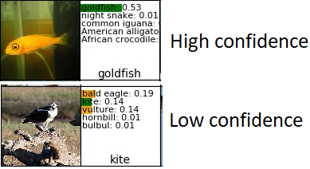
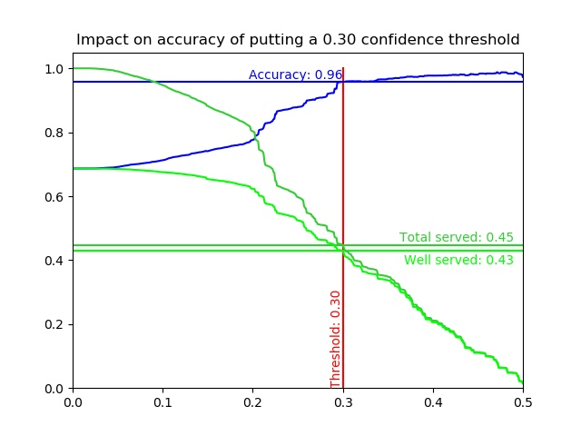

## What is confidence
- A softmax function outputs probabilities of a picture being each class.  
- The higher the output probability - the higher confidence level of a picture being that class
- Sample picture bellow shows high and low confidence levels 

## Why confidence threshold?
- Hypothetically, by eliminating low-confidence predictions, accuracy could improve
- In a self-checkout, eliminated predictions would not show a reduced tree (i.e. top k items). A customer would see a full selection tree
- Bellow graph illustrates how eliminating low-confidence predictions improves accuracy

## Observations
- When **no threshold** is used:
  - we serve **100%** of customers (limegreen line)
  - our accuracy is **68%** (same as model's test accuracy - blue line)
  - thus we serve 68% well (lime line); the other 32% get bothered with incorrect predictions
- By placing a **30% confidence threshold**:
  - we serve **45%** customers 
  - those customers are well served with **96%** accuracy (quite an improvement from 68%)
  - thus we serve **43% well** (=96% acc * 45% served); **2%** are served bad (wrong prediction); **55%** are not served at all

## Conclusion
- Proved that putting a confidence threshold improves accuracy
- Use some confidence level as a tradeoff between accuracy and how many customers you choose to serve
- The above graph only shows top-1 confidence and accuracy dependency. If threshold is not passed for a top 1, then one could check confidence of top-2, ... top-5 and use similar logic as described above to show (or not) top-k items