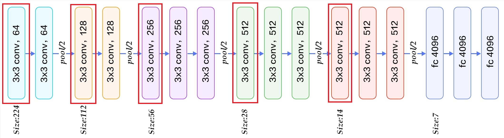
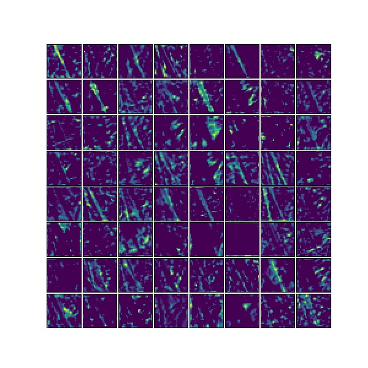

## Hidden features of a single image

Intermediate (hidden) layer activations of a single image using pre-trained VGG network.

### Original image:

### Subsequent CNN, Pooling
Bellow are 3 images of subsequent layers: 2 convolutional + 1 maxpooling
(Note how the maxpooling layer "sharpens" the image (e.g. neuron in row 1, col 5))

Convolution 1:&nbsp;
 
Convolution 2:&nbsp;

Maxpooling:&nbsp;

## Result of convolutions of the 5 CNN layers

Bellow is the result of the circumvented CNN layers of VGG

