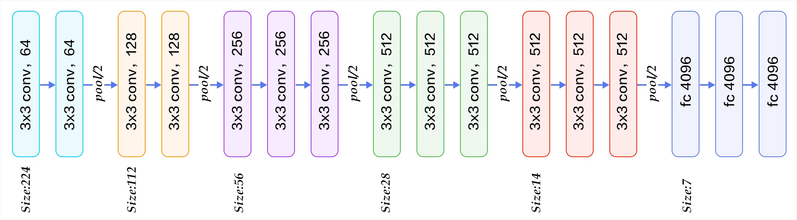

## Hidden features of a single image

Intermediate (hidden) layer activations of a single image using pre-trained VGG network.

### Network architecture

This bellow image is the VGG pre-trained network architecture.

### Original image:

## Result of convolutions of the VGG network's CNN layers

- Bellow visualizations are result of convolutions of layers of pre-trained VGG of a single image. 
- There are 5 blocks in the VGG, so there are 5 rows in table of visualizations bellow. 
- In each row I draw the first 2 convolutions and pooling layer of the block. 
- Although blocks 3, 4, and 5 contain 3 convolutional layers, I skip them for resolution puproses, but you can find them in the source directory.
- I display up to 64 images per layer, although 2-5 blocks contain more filters (up to 512)

To note:
- In the beginning layers object can still be visually recognized by a human. 
- In later layers one cannot easily identify the object. Later layers contain less information, but it's more condensed (they become "features"). 
- Some combination of the last layer features determine the class of the object. 
 
- Note how the maxpooling layer "sharpens" the image (due to resolution, this can best be seen in last block)

| Blck | Convolution 1 | Convolution 2 | Max-Pool |
|:-----:|:-------------:|:-------------:|:--------:|
| 1 |||  |
| 2 |||  |
| 3 |||  |
| 4 ||| |
| 5 |||  |

