## Hidden features of a single image

Intermediate (hidden) layer activations of a single image using pre-trained VGG network.

### Original image:

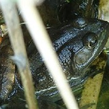

### Subsequent CNN, Pooling
Bellow are 3 images of subsequent layers: 2 convolutional + 1 maxpooling
(Note how the maxpooling layer "sharpens" the image (e.g. neuron in row 1, col 5))
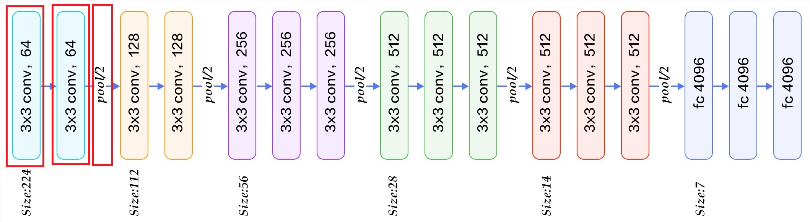

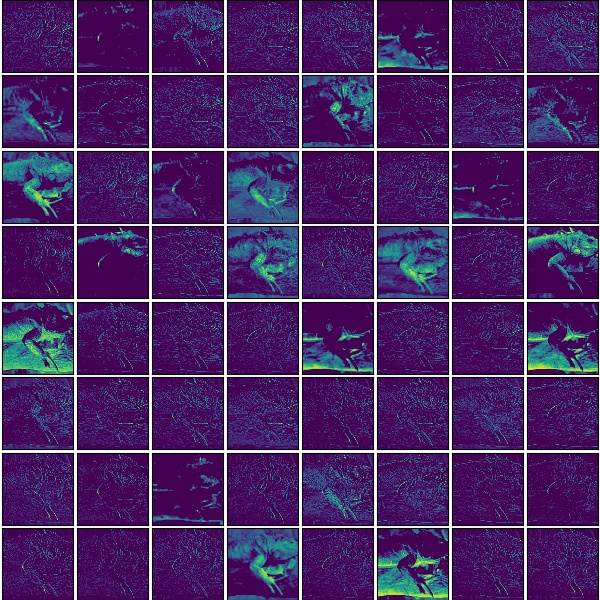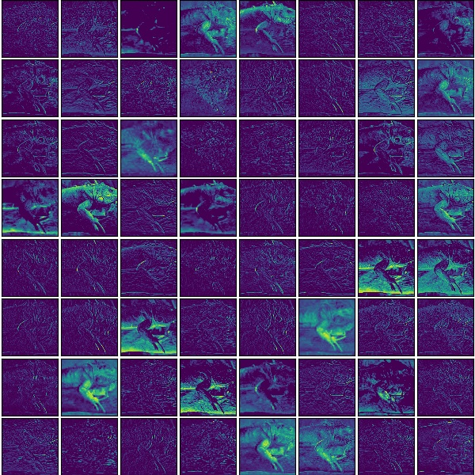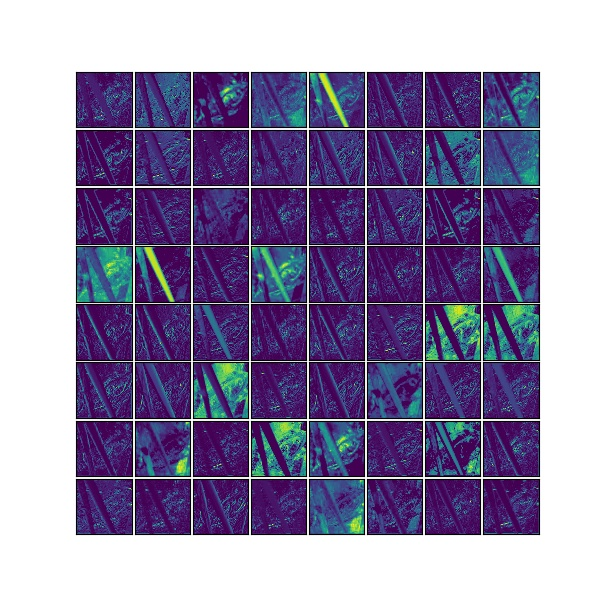

## Result of convolutions of the 5 CNN layers

Bellow is the result of the circumvented CNN layers of VGG
Note how in the beginning layers object can still be visually recognized by a human.
Note that from later layers one cannot easily identify the object. Later layers contain less information, those are extracted features. Some combination of the last layer features determine the class of the object. 

  
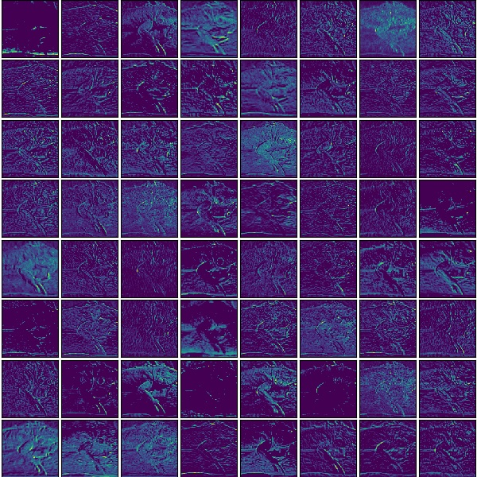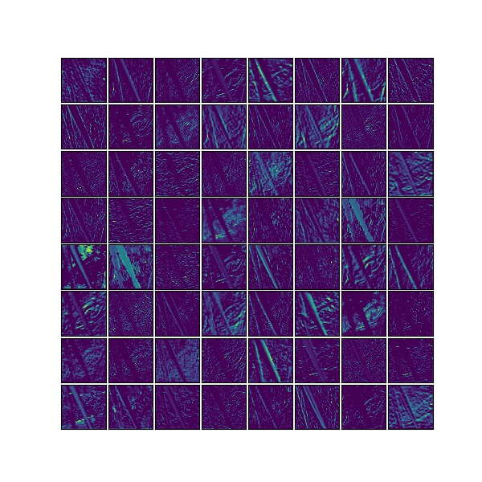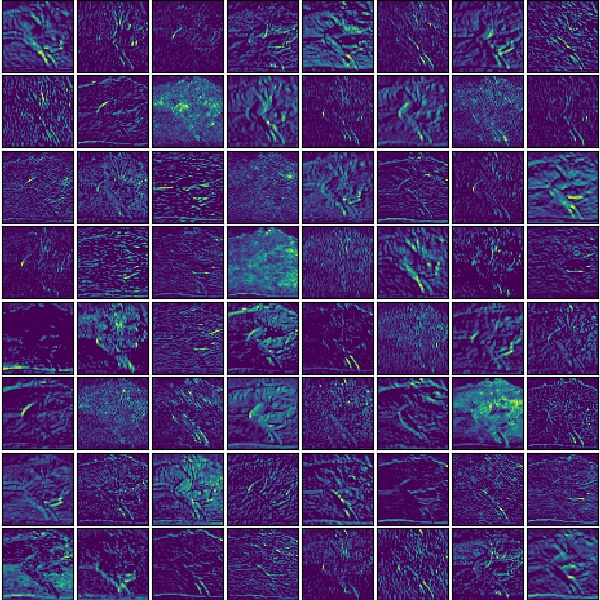  
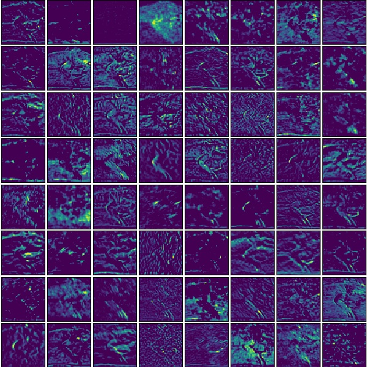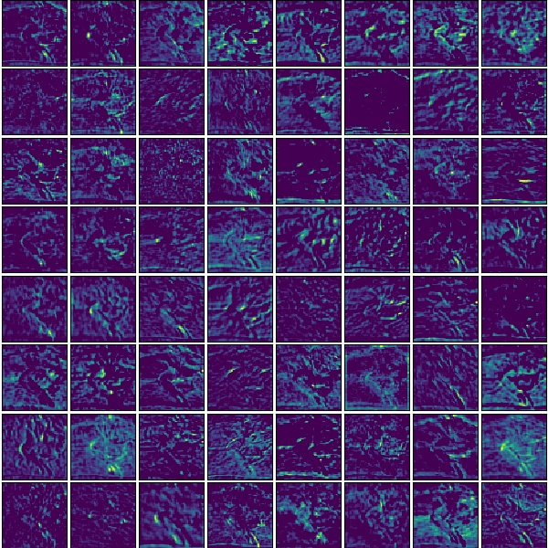  
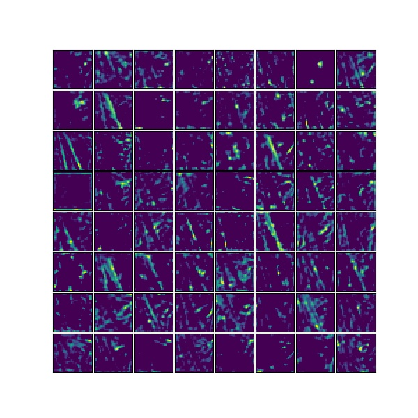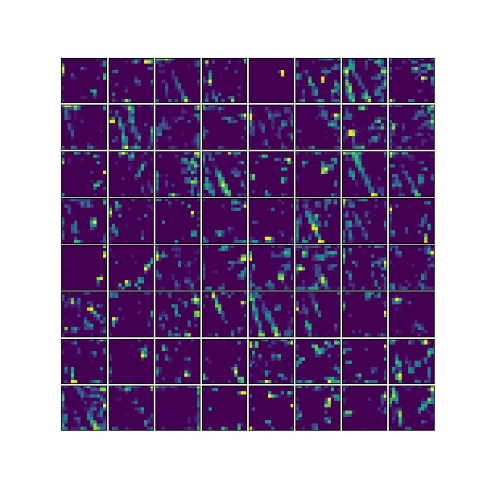  
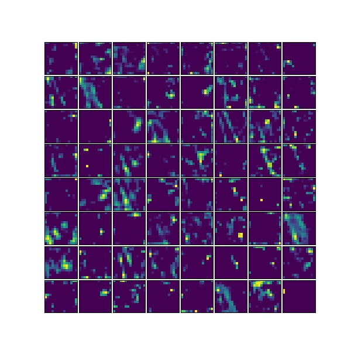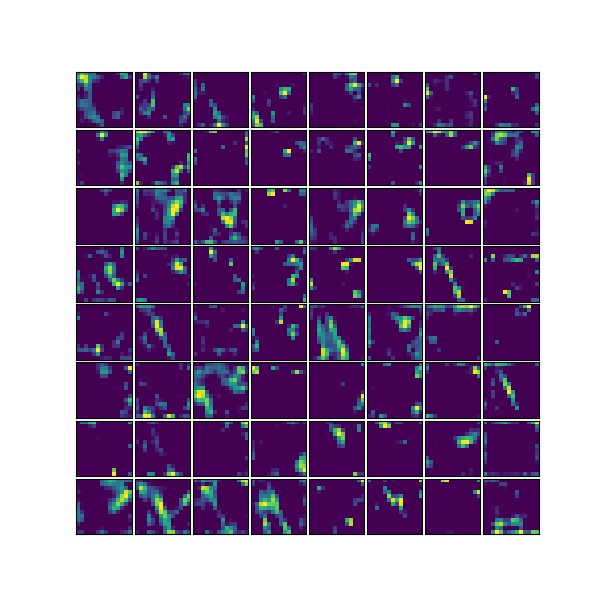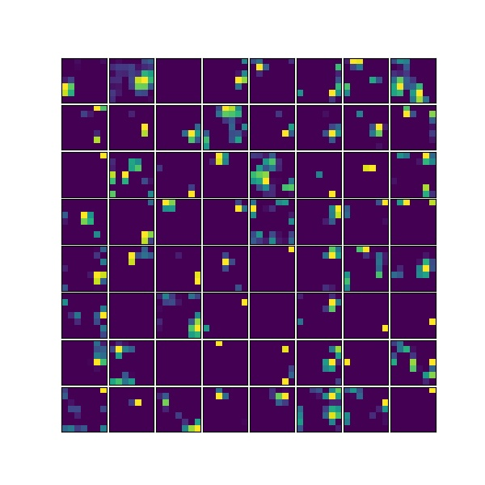  

