## Layer 2 neurons

Second layer activations are shaped by patches of size 27x27, which comes from the following:
- First filter size 7x7, stride 2
- Maxpooling with size 3, stride 2
- Second layer filter size 5

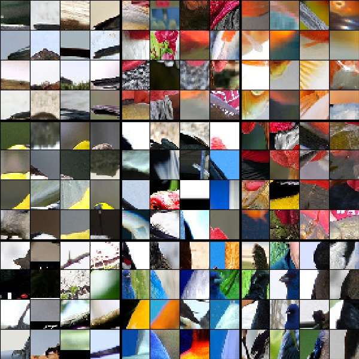
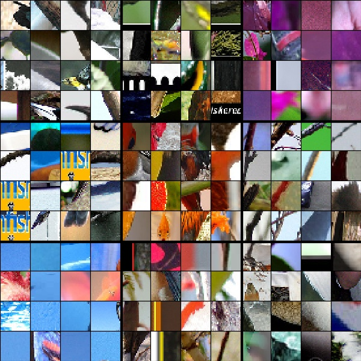

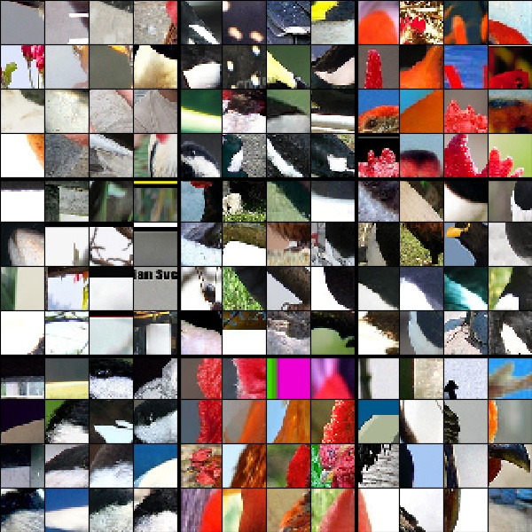
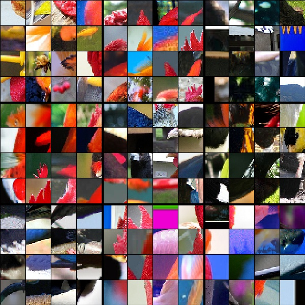

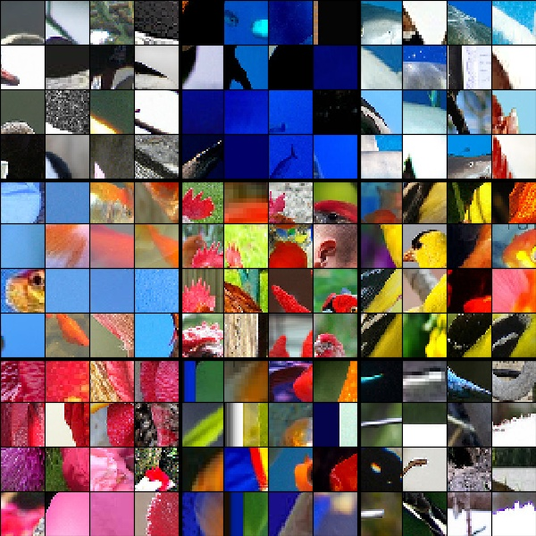

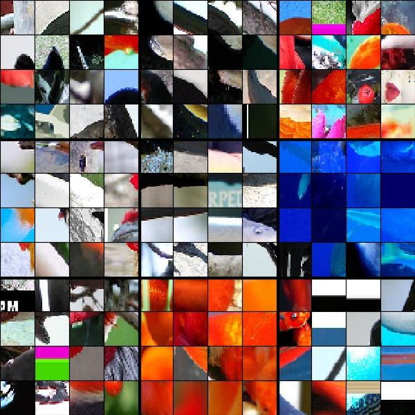
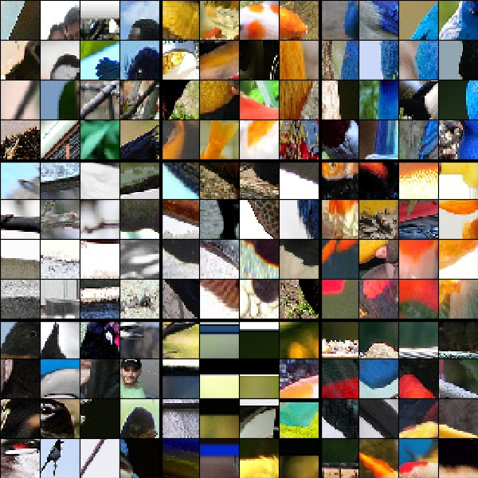
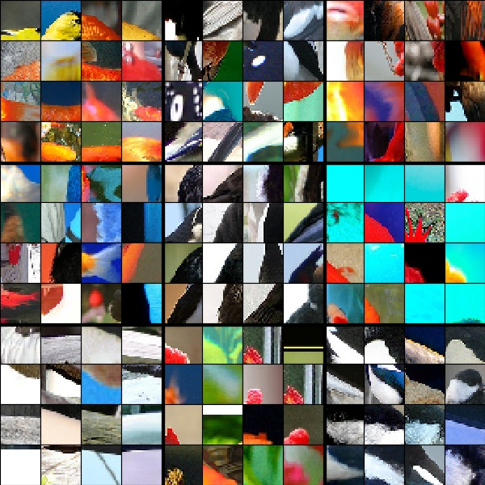
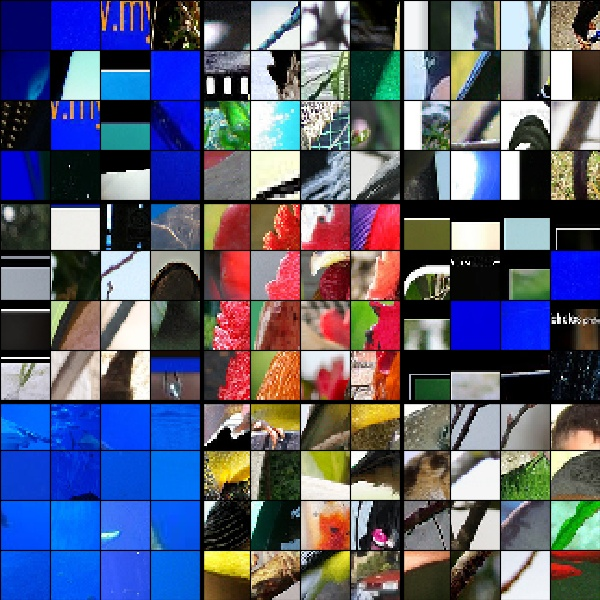
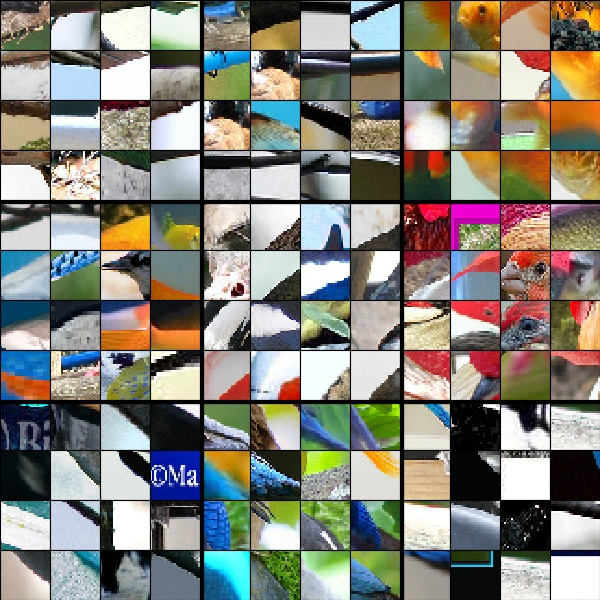

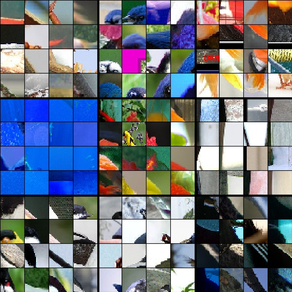
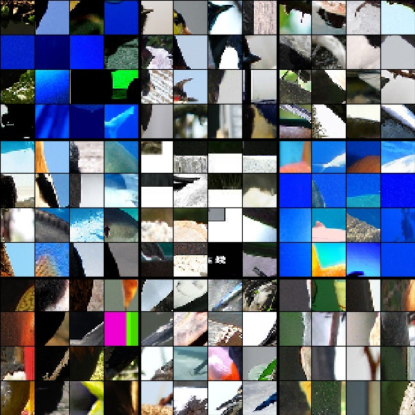

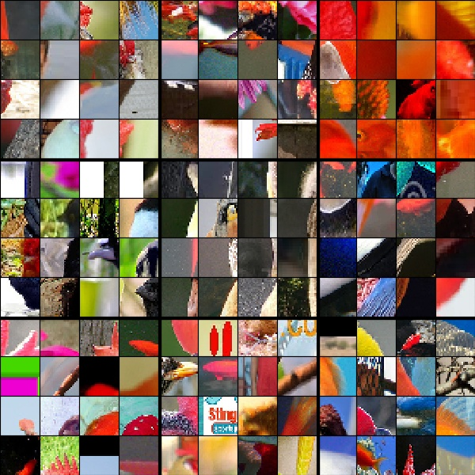
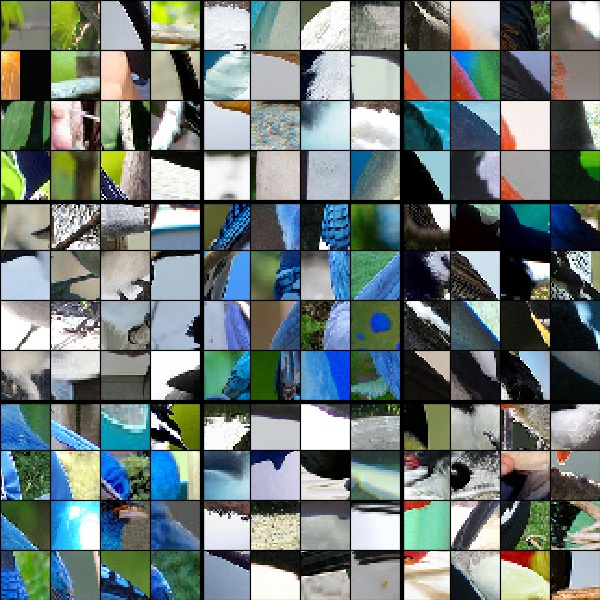
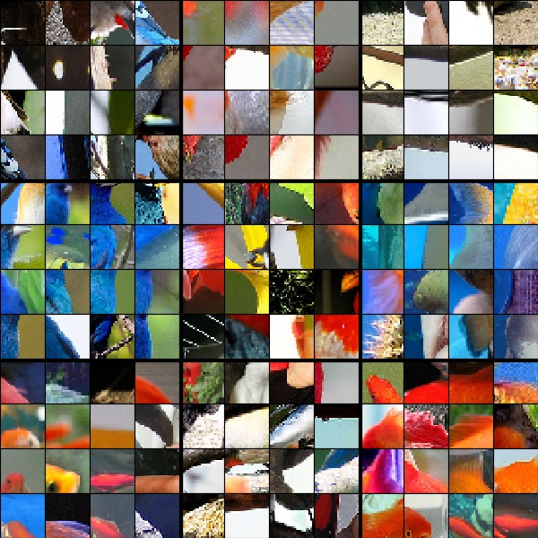
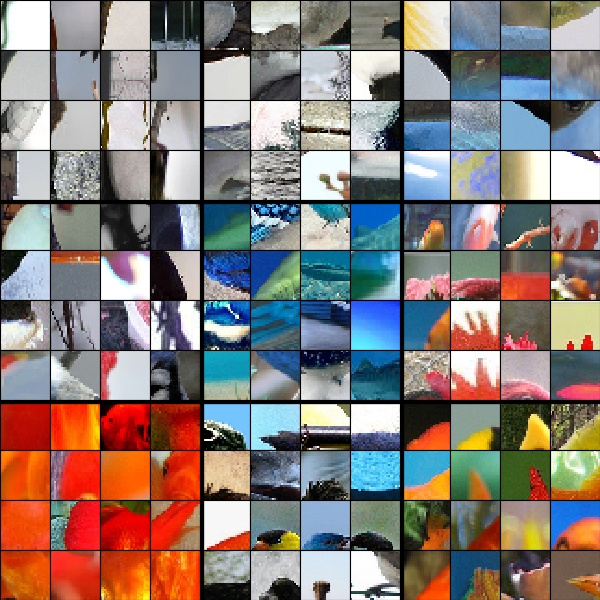
