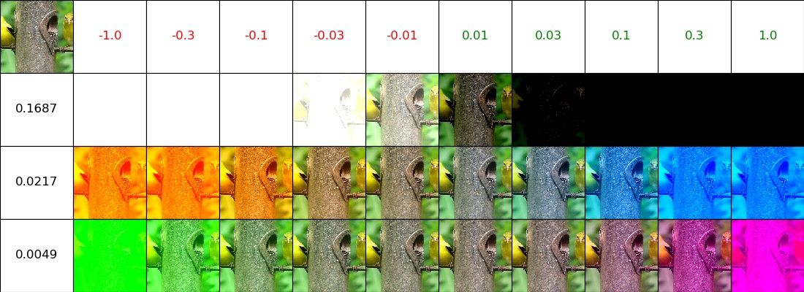
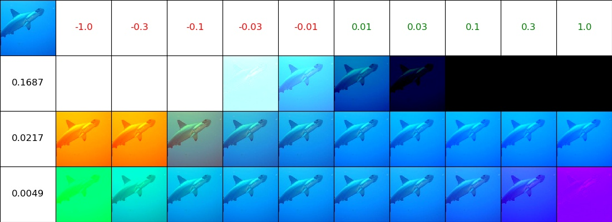
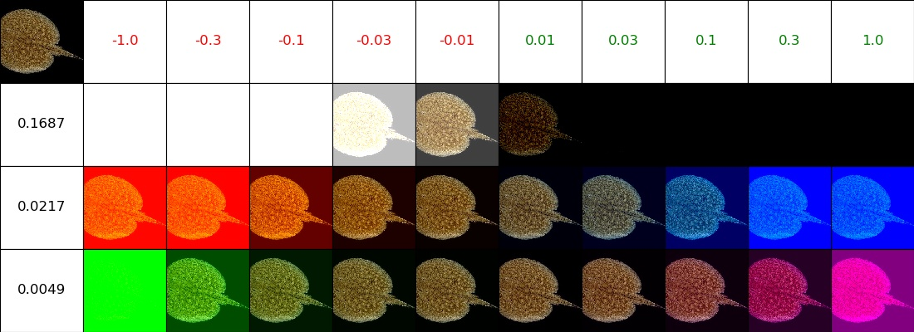
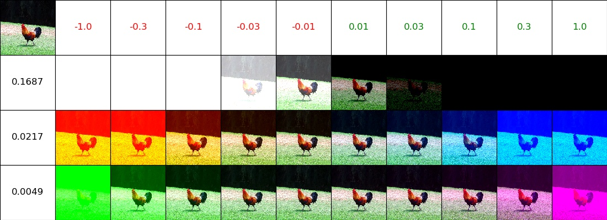
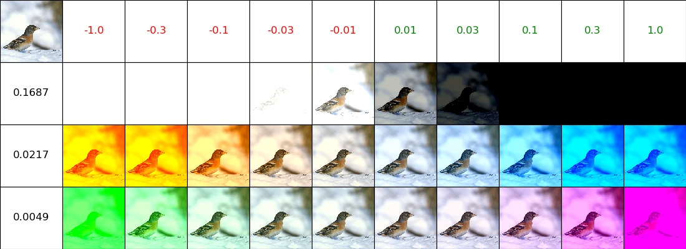
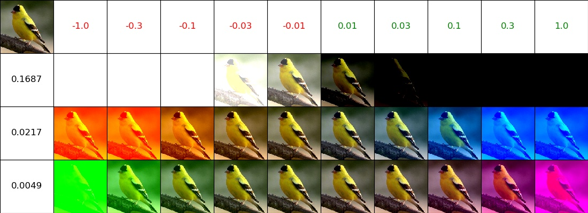
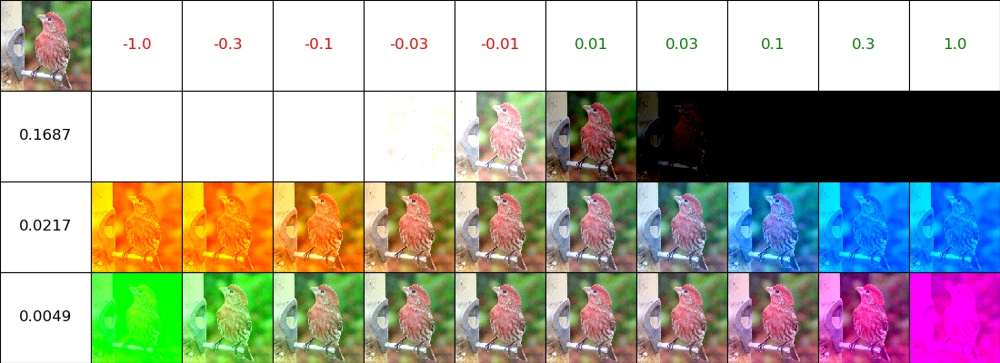
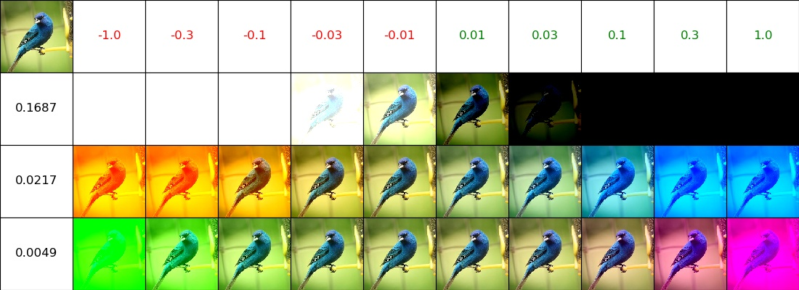

# PCA distortion

## Why 
As a means of regularization (to prevent overfitting), instead of using original images while training - 
distort them in every epoch by different (random) amount.

## Technique used:
1. PCA was performed on entire training set R, G, B values 
2. Resulting was 3 Principal components: eigenvectors (3-dimensional PC[1:3]) and eigenvalues (scalar - Lambda[1:3])
3. Using each of 3 principal components separately PC(i):
   a. Alpha chosen of different values (-1.0, -0.3, ... 1.0) 
   b. RGB += PC(i) * Lambda(i) * Alpha

## Bellow are samples of image distortion:
1. Top/Left contains original image
2. Row headers contain Lambda (eigenvalues) of chosen Principal Component
3. Column headers contain Alpha values (distortion coefficient)
4. Cells contain distorted images

